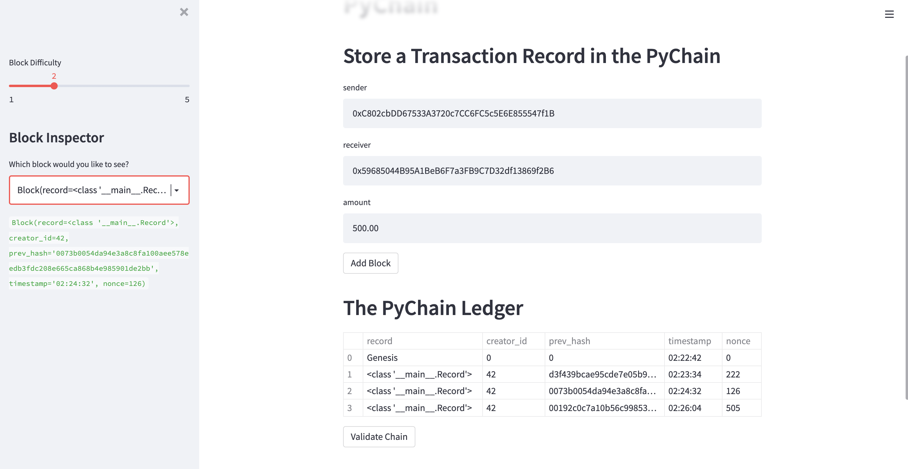
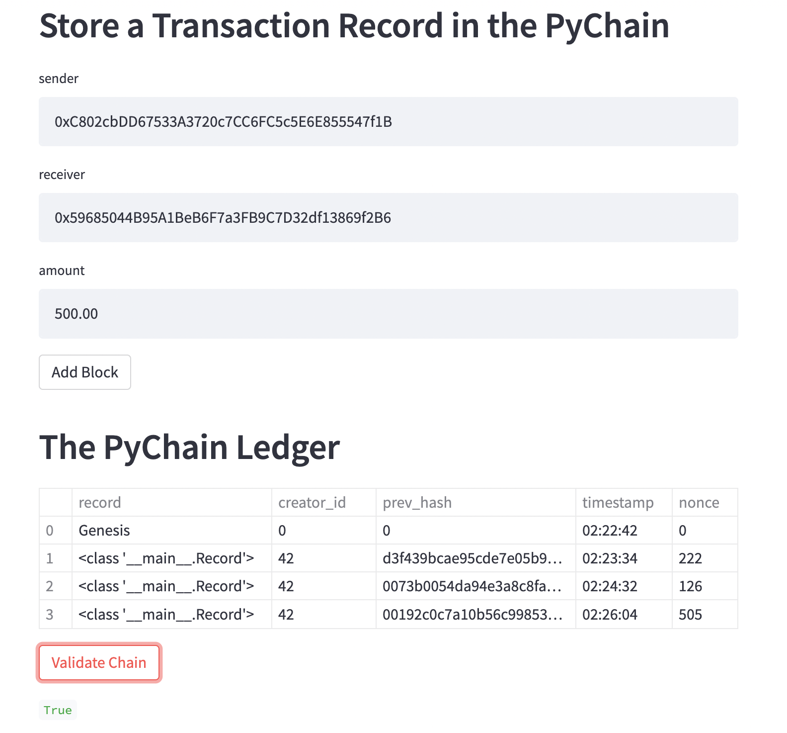

# PyChain-Ledger
##Challenge 18

##Technologies
This application is written using Python 3.9.7 with the Streamlit library to create a shareable webpage interface for a blockchain.  Instances of Block and Record Data Classes are created and sender, recipient and amount data for a transaction are added as user input on the Streamlit webpage. The data, including the hash of the previous block as an attribute and is encoded and passed to the sha256 hashing function. The hash for the new block is added to the blockchain and stored in the PyChain Data Class. The difficulty for a consensus Proof of Work algorithm is adjusted using a slider in the Streamlit sidebar, and the individual blocks can be inspected using a dropdown menu. A method for validating the blockchain by comparing the previous hash attribute of the next block to the calculated hash of the current block. 

## Installation Guide
Install the streamlit and pandas libraries, datetime and hashlib modules, the dataclass function and data types from the typing module.

## Usage
Run the streamlit webpage application with the command 'streamlit run pychain.py'.

## Contributors
This program was written by David Hockenbery with the assistance of the UW FinTech class of 2021 and instructors. Contact David at dhockenb@gmail.com.

## License
Copyright (c) [2022] [David Hockenbery]

Permission is hereby granted, free of charge, to any person obtaining a copy
of this software and associated documentation files (the "Software"), to deal
in the Software without restriction, including without limitation the rights
to use, copy, modify, merge, publish, distribute, sublicense, and/or sell
copies of the Software, and to permit persons to whom the Software is
furnished to do so, subject to the following conditions:

The above copyright notice and this permission notice shall be included in all
copies or substantial portions of the Software.

THE SOFTWARE IS PROVIDED "AS IS", WITHOUT WARRANTY OF ANY KIND, EXPRESS OR
IMPLIED, INCLUDING BUT NOT LIMITED TO THE WARRANTIES OF MERCHANTABILITY,
FITNESS FOR A PARTICULAR PURPOSE AND NONINFRINGEMENT. IN NO EVENT SHALL THE
AUTHORS OR COPYRIGHT HOLDERS BE LIABLE FOR ANY CLAIM, DAMAGES OR OTHER
LIABILITY, WHETHER IN AN ACTION OF CONTRACT, TORT OR OTHERWISE, ARISING FROM,
OUT OF OR IN CONNECTION WITH THE SOFTWARE OR THE USE OR OTHER DEALINGS IN THE
SOFTWARE.
